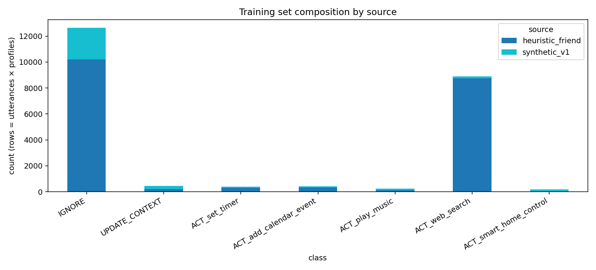
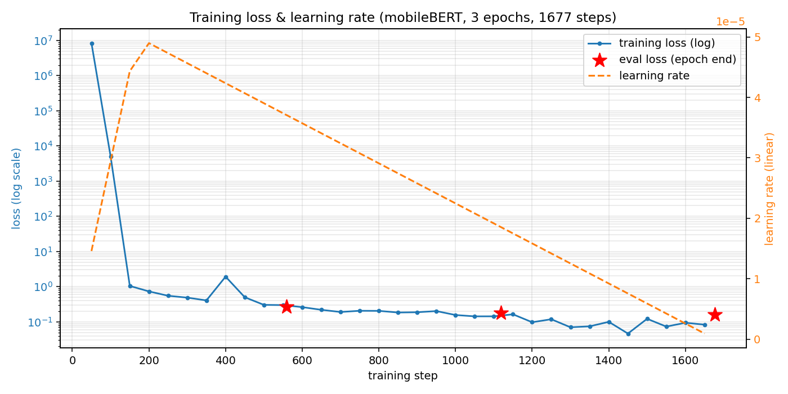
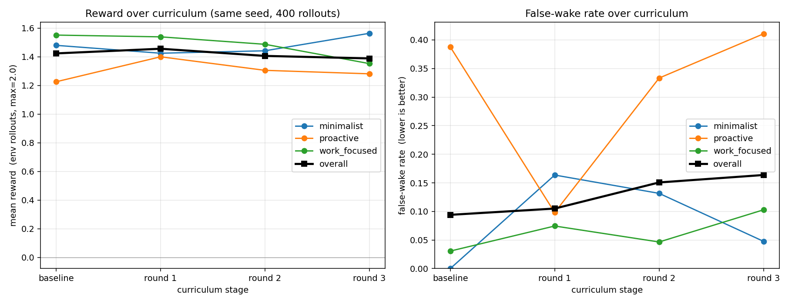
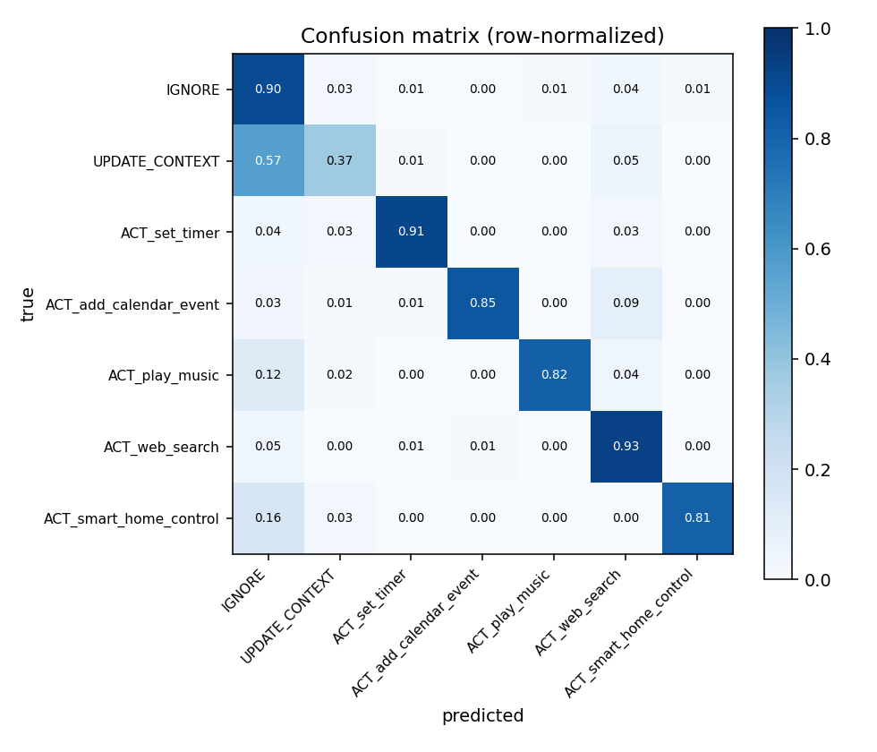

# Audible — Self-Improving Ambient-Listening Gate

> A self-improving OpenEnv environment that teaches a small (~25M-param)
> **mobileBERT** classifier to be the *gate* of an always-on voice assistant —
> deciding when to act, what tool to call, and how to honor each user's
> preferred level of intervention.

> **Hackathon:** Meta OpenEnv Hackathon 2026 — **Theme #4: Self-Improvement**.

| | |
|---|---|
| **Environment (HF Space)** | https://huggingface.co/spaces/me-tusharchandra/audible-env |
| **Live Web UI** | https://me-tusharchandra-audible-env.hf.space/web |
| **Health check** | `curl https://me-tusharchandra-audible-env.hf.space/health` → `{"status":"healthy"}` |
| **Code repository** | https://github.com/me-tusharchandra/audible |
| **Blog post / writeup** | [`audible_env/BLOG.md`](audible_env/BLOG.md) — the full story + the 4× false-wake reduction headline |
| **Colab notebook** | [`training/notebook.ipynb`](training/notebook.ipynb) — 20 cells, ~10–15 min runtime |
| **Demo video** | `_paste your YouTube link here once recorded_` |
| **Friend's prior work** | https://github.com/pranjal-pravesh/actionable-gating-classifier |

---

## Table of contents

- [Audible — Self-Improving Ambient-Listening Gate](#audible--self-improving-ambient-listening-gate)
  - [Table of contents](#table-of-contents)
  - [The 30-second pitch](#the-30-second-pitch)
  - [Why ambient gating is hard](#why-ambient-gating-is-hard)
  - [What we built — at a glance](#what-we-built--at-a-glance)
  - [The OpenEnv environment](#the-openenv-environment)
    - [Action space](#action-space)
      - [The 5-tool palette](#the-5-tool-palette)
    - [Observation space](#observation-space)
      - [The 3 user profiles](#the-3-user-profiles)
    - [The composite rubric](#the-composite-rubric)
      - [Worked examples of reward computation](#worked-examples-of-reward-computation)
    - [Episode structure](#episode-structure)
  - [The model — why mobileBERT](#the-model--why-mobilebert)
  - [The data pipeline](#the-data-pipeline)
    - [Source 1: friend's binary dataset](#source-1-friends-binary-dataset)
    - [Source 2: heuristic 7-class mapping](#source-2-heuristic-7-class-mapping)
    - [Source 3: LLM-generated synthetic scenarios](#source-3-llm-generated-synthetic-scenarios)
    - [Combined dataset](#combined-dataset)
  - [Phase 2 — baseline training](#phase-2--baseline-training)
  - [Phase 3 — adaptive curriculum (Theme #4)](#phase-3--adaptive-curriculum-theme-4)
    - [What an adaptive curriculum is](#what-an-adaptive-curriculum-is)
    - [The loop](#the-loop)
    - [Why this is self-improvement and not supervised SFT](#why-this-is-self-improvement-and-not-supervised-sft)
    - [Configuration we ran](#configuration-we-ran)
  - [Results](#results)
    - [Headline finding](#headline-finding)
    - [Curves over the curriculum](#curves-over-the-curriculum)
    - [Round-by-round, per profile](#round-by-round-per-profile)
    - [Confusion matrix (round-3 model, dataset eval)](#confusion-matrix-round-3-model-dataset-eval)
    - [Honest research finding: curriculum length matters](#honest-research-finding-curriculum-length-matters)
  - [How to use — three modes](#how-to-use--three-modes)
    - [Mode 1: quick interactive eval against the live Space](#mode-1-quick-interactive-eval-against-the-live-space)
    - [Mode 2: Python client against the live Space](#mode-2-python-client-against-the-live-space)
    - [Mode 3: reproduce training locally](#mode-3-reproduce-training-locally)
    - [Mode 4: Colab notebook (judge-runnable)](#mode-4-colab-notebook-judge-runnable)
  - [Repository structure](#repository-structure)
  - [Build timeline — what got built when](#build-timeline--what-got-built-when)
  - [Honest scope notes \& trade-offs](#honest-scope-notes--trade-offs)
  - [Demo video — talking points](#demo-video--talking-points)
    - [Full voiceover script (~290 words, ≈ 1:55 at normal pace)](#full-voiceover-script-290-words--155-at-normal-pace)
    - [Visual cues (what to show on screen)](#visual-cues-what-to-show-on-screen)
    - [Tips for delivery](#tips-for-delivery)
  - [Future work](#future-work)
  - [Acknowledgments](#acknowledgments)

---

## The 30-second pitch

Wake-word gating ("Hey Siri", "Alexa") is a solved problem. **Always-on listening
isn't.** The hard cases aren't direct commands — they're *ambient utterances*
where a tool keyword appears but the speaker isn't actually addressing the
assistant. Friend's binary classifier scored 97% F1 on hand-curated data but
collapses on real ambient cases because the dataset never asked the right
question.

**Audible** is an OpenEnv environment that trains a small edge-deployable
mobileBERT classifier to handle these cases — with a **per-user preference
profile** that personalizes the gate's behavior, and an **adaptive adversarial
curriculum** where a generator agent escalates difficulty as the gate improves.

**Headline result:** one round of self-improvement curriculum dropped the
hardest profile's false-wake rate from **38.8% → 9.8%** — a 4× reduction —
while preserving overall accuracy. That co-evolution between the generator
and the gate is what makes this Theme #4 self-improvement, not supervised SFT
with extra steps.

---

## Why ambient gating is hard

Imagine a phone or smart-home device listening continuously. It hears a steady
stream of utterances. Most are *not addressed to it.* Some are commands. Some
are rhetorical. Some sound like commands but aren't. The hard cases:

| Utterance | Why it's hard |
|---|---|
| *"Hold on a sec, grabbing my keys"* | `set_timer`-shaped phrase, but it's not a command |
| *"Did you set the timer for the cookies?"* | Addressing another person, mentions a tool |
| *"I love this song that's playing"* | Comment about music, not a `play_music` request |
| *"I wonder what the weather's like"* | For one user this is a `web_search`; for another it's noise |
| *"It's a bit bright in here"* | For one user this is `smart_home_control`; for another it's an observation |
| *"Don't bother setting any timer"* | Negation around a tool keyword |

A naive keyword-matching gate wakes on all of these. A binary
"actionable / non-actionable" classifier (the standard baseline) misses the
**per-user personalization** layer entirely — different users have different
tolerances for proactive behavior. **Audible** frames this as a 3-class
+ 5-tool gating problem with a per-user preference profile.

---

## What we built — at a glance

```
┌─────────────────────────────────────────────────────────────────────────┐
│                       Audible — system diagram                          │
└─────────────────────────────────────────────────────────────────────────┘

   ┌────────────────────┐        ┌────────────────────────────────────┐
   │  Friend's binary   │        │   OpenAI gpt-4o-mini synthetic     │
   │  dataset (CSV)     │        │   scenario generator               │
   │  6,647 utterances  │        │   (6 categories, structured        │
   └─────────┬──────────┘        │    outputs, profile-divergent)     │
             │                   └──────────────┬─────────────────────┘
             │                                  │
             ▼                                  ▼
   ┌────────────────────┐        ┌────────────────────────────────────┐
   │ Heuristic regex →  │        │  803 fresh, balanced, ambient-     │
   │ 7-class mapping    │        │  confusable, profile-divergent     │
   └─────────┬──────────┘        │  scenarios                         │
             │                   └──────────────┬─────────────────────┘
             │                                  │
             └────────────────┬─────────────────┘
                              │
                              ▼
                  ┌──────────────────────┐
                  │  combined.parquet    │     ← 22,350 (utterance × profile) rows
                  │  7,450 unique utts   │
                  └──────────┬───────────┘
                             │
                             ▼
              ┌──────────────────────────────┐
              │  mobileBERT 7-way classifier │     Phase 2: baseline SFT
              │  (sentence-pair input,       │     3 epochs, class-weighted CE
              │   24.6M params, edge-ready)  │
              └──────────────┬───────────────┘
                             │
                             ▼
       ┌──────────────────────────────────────────────┐
       │             OpenEnv environment              │
       │  ┌────────────────────────────────────────┐  │
       │  │ reset() → (utterance, profile, tools)  │  │
       │  │ step(action) → reward via composite    │  │
       │  │   Rubric (4 components, range [-1,2])  │  │
       │  └────────────────────────────────────────┘  │
       │                                              │
       │   Hosted on HF Space (Docker, FastAPI+WS)    │
       └──────────────┬───────────────────────────────┘
                      │
                      ▼
        ┌─────────────────────────────────────────────┐
        │   Phase 3: adaptive curriculum loop         │
        │   ┌─────────────────────────────────────┐   │
        │   │ 1. eval gate against env            │   │
        │   │ 2. mine worst-reward rollouts       │   │
        │   │ 3. generate harder adv. variations  │   │
        │   │ 4. append to dataset, retrain       │   │
        │   │ 5. repeat                           │   │
        │   └─────────────────────────────────────┘   │
        └─────────────────────────────────────────────┘
```

---

## The OpenEnv environment

The env follows OpenEnv's standard `Environment` base class (not `MCPEnvironment`
— our agent emits a *classification*, not real MCP tool invocations, so the
simpler `Environment` is the right fit).

### Action space

Typed, structured pydantic dataclass:

```python
class GateAction(Action):
    decision : Literal["ACT", "UPDATE_CONTEXT", "IGNORE"]
    tool     : Optional[Literal["set_timer", "add_calendar_event",
                                "play_music", "web_search",
                                "smart_home_control"]]
```

Three top-level decisions, five concrete tools. `tool` is only meaningful
when `decision == "ACT"`.

#### The 5-tool palette

| Tool | What it does | Example direct command | Example ambient confusable (should *not* trigger) |
|---|---|---|---|
| `set_timer` | Start a countdown / reminder | "Set a 10 minute timer" | "Hold on a sec, I'll be right back" |
| `add_calendar_event` | Create a new calendar event | "Add a meeting tomorrow at 3" | "Sarah and I might catch up tomorrow" |
| `play_music` | Start audio playback | "Play some lo-fi" | "I love this song that's playing" |
| `web_search` | Look up a fact / answer a question | "What's the weather in Tokyo?" | "I wonder what the weather's like" |
| `smart_home_control` | Change a physical device's state | "Turn off the kitchen lights" | "It's a bit bright in here" |

The palette was chosen so each tool has obvious confusable ambient examples
— that's what makes the gating decision genuinely hard.

### Observation space

```python
class GateObservation(Observation):
    utterance        : str                       # what the mic transcribed
    context_history  : list[str]                 # up to N prior turns
    user_profile     : Literal["minimalist",     # active user's preference
                               "proactive",
                               "work_focused"]
    available_tools  : list[{name, description}] # the 5-tool palette

    # populated only on post-step observations (for rubric scoring + eval):
    scenario_id      : Optional[int]
    ground_truth     : Optional[dict]            # {decision, tool}
    component_scores : Optional[dict]            # per-rubric breakdown
```

The agent's *input features* are the first four fields. The post-step diagnostic
fields cannot live in `observation.metadata` because OpenEnv's serializer
strips that field from the wire payload — discovered the hard way during
WebSocket testing.

#### The 3 user profiles

Each profile encodes a different "how proactive should the assistant be" preference:

| Profile | Behavior |
|---|---|
| `minimalist` | Acts ONLY on direct first-person imperatives clearly addressed to the assistant. Anything indirect, third-person, or ambient → IGNORE. |
| `proactive` | Acts on direct commands AND indirect cues ("I wonder what the weather's like" → `web_search`, "it's freezing in here" → `smart_home_control`). But not omniscient — vague cues still IGNORE. |
| `work_focused` | Acts on `set_timer` / `add_calendar_event` / `web_search`. NEVER fires `play_music` or `smart_home_control` even when explicitly asked — silence-during-deep-work mode. |

Profile-aware labelling is the most valuable signal in the dataset, because
the same utterance can warrant **different** correct actions for different
users. Most existing voice-assistant datasets ignore this entirely.

### The composite rubric

Reward is a weighted sum of four components, each defined as a separate
`Rubric` subclass for introspection (the per-component scores propagate back
to the agent in `observation.component_scores`):

```python
class GateRubric(Rubric):
    def forward(self, action, observation) -> float:
        return (
            1.0 * gate_correctness(action, observation)   # decision matches GT
          + 0.5 * tool_correctness(action, observation)   # tool matches when both ACT
          + 0.5 * profile_alignment(action, observation)  # action honors profile
          + 1.0 * false_wake_penalty(action, observation) # -1 if ACT when GT=IGNORE
        )
```

| Component | Weight | Range | When it fires |
|---|---|---|---|
| `gate_correctness` | +1.0 | {0, 1} | `action.decision` matches ground truth |
| `tool_correctness` | +0.5 | {0, 1} | both decisions are ACT *and* tool matches |
| `profile_alignment` | +0.5 | {0, 1} | action honors the active profile's preference |
| `false_wake_penalty` | +1.0 | {-1, 0} | predicted ACT but GT was IGNORE/UPDATE_CONTEXT |

**Reward range: `[-1.0, +2.0]`.**

Why this weighting? **False wakes are the most painful UX failure** of an
always-on listening device — a single spurious activation in a meeting is
worse than ten missed activations. The asymmetric penalty (`-2.0` net effect
relative to a correct IGNORE) reflects that.

#### Worked examples of reward computation

Example: utterance "Hold on a sec", profile=`minimalist`, GT=`(IGNORE, None)`.

| Agent's action | gate | tool | profile | false_wake | Total |
|---|---:|---:|---:|---:|---:|
| `IGNORE` | +1.0 | 0 | +0.5 | 0 | **+1.5** ✓ |
| `ACT, set_timer` (false wake) | 0 | 0 | 0 | -1.0 | **-1.0** ✗ |
| `UPDATE_CONTEXT` | 0 | 0 | 0 | 0 | **0.0** |

Example: utterance "Set a timer for 10 minutes", profile=`work_focused`, GT=`(ACT, set_timer)`.

| Agent's action | gate | tool | profile | false_wake | Total |
|---|---:|---:|---:|---:|---:|
| `ACT, set_timer` | +1.0 | +0.5 | +0.5 | 0 | **+2.0** ✓ |
| `ACT, web_search` (wrong tool) | +1.0 | 0 | +0.5 | 0 | **+1.5** |
| `IGNORE` | 0 | 0 | 0 | 0 | **0.0** |

### Episode structure

Single step. `reset()` samples one (scenario, profile) pair from the held-out
seed scenario set; `step(action)` scores the agent's classification with the
composite rubric and returns `done=True` with `reward` attached and
`ground_truth` + `component_scores` in the observation for eval.

We chose single-step over multi-turn because:
- mobileBERT is a single-input classifier — multi-turn doesn't fit naturally
- Per-component scores are easy to plot when each rollout is one decision
- Real conversational tracking is future work; the `context_history` field
  on the observation is plumbed but currently always empty/very short

---

## The model — why mobileBERT

We use [`google/mobilebert-uncased`](https://huggingface.co/google/mobilebert-uncased)
(**~25M params, ~98 MB float32, ~25 MB int8**, runs in real-time on CPU and
on-device).

| Why not a frontier LLM? | Why not a tinier model? |
|---|---|
| The whole point of an ambient gate is that it has to fit on a phone and respond instantly (<100 ms). | mobileBERT is the smallest pretrained model with strong sentence-pair NSP performance — DistilBERT is similar size but loses the NSP signal we use. |
| A frontier LLM could do this much better — but it can't run on-device, and that's where this problem actually lives. | Friend's prior work already proved mobileBERT is CoreML/TFLite-exportable, so the edge story is not aspirational. |

**Input format:** sentence pair `(profile_description, utterance)` —
mobileBERT was pre-trained with NSP, so the `[SEP]`-separated two-sentence
layout is a natural fit and lets the model condition its prediction on the
profile.

**Head:** standard `AutoModelForSequenceClassification` with `num_labels=7`:

```
0  IGNORE
1  UPDATE_CONTEXT
2  ACT_set_timer
3  ACT_add_calendar_event
4  ACT_play_music
5  ACT_web_search
6  ACT_smart_home_control
```

A single 7-way head (rather than two heads for decision + tool) keeps the
model architecture simple. Tool selection is implicit in classes 2–6.

---

## The data pipeline

Three sources combined into one parquet, with each step writing a
intermediate artifact for reproducibility.

### Source 1: friend's binary dataset

[`pranjal-pravesh/actionable-gating-classifier`](https://github.com/pranjal-pravesh/actionable-gating-classifier)
already had a strong mobileBERT baseline trained on **6,647 unique utterances**
(after dedup) labeled binary actionable=1 / non-actionable=0:

- `final_dataset.csv` — 5,361 rows, balanced 50/50
- `second_finetune_data.csv` — 1,301 rows
- Reported metrics: 97.3% F1 on its own binary task

**Strength:** lexical diversity (Wikipedia sentences as distractors, Gemini-generated commands), high-quality binary labels.

**Weakness:** zero tool granularity (binary only), zero profile divergence,
zero ambient confusable cases (the *interesting* failure mode).

### Source 2: heuristic 7-class mapping

We map each (text, binary_label) row to one of our 7 classes via keyword
regex rules in [`audible_env/data/build_labels.py`](audible_env/data/build_labels.py):

| If `binary_label == 0` (non-actionable) | If `binary_label == 1` (actionable) |
|---|---|
| Schedule / future-plans pattern → `UPDATE_CONTEXT` | "remind", "set timer", "alarm" → `ACT_set_timer` |
| Otherwise → `IGNORE` | "schedule", "meeting", "calendar" → `ACT_add_calendar_event` |
| | "play X music/song" → `ACT_play_music` |
| | "lights", "thermostat", on/off + device → `ACT_smart_home_control` |
| | Wh-question → `ACT_web_search` |
| | (fallback) → `ACT_web_search` |

Then per-profile rules:

- `minimalist`, `proactive`: keep heuristic labels as-is on this dataset
- `work_focused`: collapse `ACT_play_music` and `ACT_smart_home_control` → `IGNORE`

**Output:** `audible_env/data/labeled.parquet`, **19,941 rows** (6,647 utterances × 3 profiles).

**Quality issue (acknowledged):** the regex fallback collapses many actionable
commands without obvious tool keywords into `ACT_web_search` — e.g. "stop calling
me charlie and from now on always call me chip" gets mis-labeled as `web_search`.
Synthetic data + curriculum compensate.

### Source 3: LLM-generated synthetic scenarios

Generated by [`training/synthetic_data.py`](training/synthetic_data.py) with
**OpenAI gpt-4o-mini + Structured Outputs** (Pydantic schema for parsed
responses). Six categories targeting the ambient cases the friend's binary
data lacks:

| Category | Quota | Why |
|---|---:|---|
| `ambient_confusable` | 200 | Tool keyword present but speaker isn't addressing the assistant |
| `direct_command_balanced` | 200 | Even tool distribution to fix the heuristic's web_search skew |
| `indirect_address` | 150 | "I wonder…", "it's freezing in here" — proactive's home turf |
| `multi_speaker_chatter` | 120 | Two-person conversation snippets the mic overhears |
| `rhetorical_question` | 80 | Question shape but no answer wanted |
| `update_worthy` | 80 | Notable info worth remembering, no action right now |

**Prompt iteration:** v1 produced reasonable but formulaic utterances (lots of
"I should have…"). v2 added explicit tool semantics, diversity rules
("don't start every utterance with 'I'"), and concrete bad examples to avoid
("I would like to inquire about the weather forecast" — too formal). Quality
went from 7/10 to 8/10 on manual inspection.

**Cost:** ~$0.17 in API calls for the full 803 unique utterances (gpt-4o-mini
is cheap; the bulk of cost is output tokens).

**Output:** `audible_env/data/synthetic/synthetic_v1.parquet`, **2,490 rows** (803 × 3 profiles).

### Combined dataset

[`training/combine_datasets.py`](training/combine_datasets.py) merges and dedupes:

```
heuristic_friend:  19,941 rows ( 6,647 utterances)
synthetic_v1:       2,490 rows (   803 utterances)
                  ─────────
combined:          22,350 rows ( 7,450 utterances after dedup)
```

Synthetic dramatically improves tool balance:

| Class | Heuristic only | Synthetic only |
|---|---:|---:|
| `IGNORE` | 51.1% | 68.7% |
| `UPDATE_CONTEXT` | 1.1% | **8.7%** |
| `ACT_set_timer` | 1.5% | **4.5%** |
| `ACT_add_calendar_event` | 1.6% | **4.5%** |
| `ACT_play_music` | 0.8% | **3.8%** |
| `ACT_web_search` | 43.9% | 5.6% |
| `ACT_smart_home_control` | 0.4% | **4.3%** |



---

## Phase 2 — baseline training

Implemented in [`training/train.py`](training/train.py):

- **Base model:** `google/mobilebert-uncased`, 24.6M params
- **Head:** `AutoModelForSequenceClassification`, `num_labels=7`
- **Input:** sentence pair `(profile_description, utterance)`, max_length=128
- **Loss:** **class-weighted cross-entropy** in a custom `WeightedTrainer`
  (HF `Trainer` subclass). Class weights are inverse-frequency, smoothed,
  normalized so mean weight ≈ 1.0:
  ```
  IGNORE         0.23   ACT_set_timer            1.25
  UPDATE_CONTEXT 1.24   ACT_add_calendar_event   1.24
                        ACT_play_music           1.36
                        ACT_web_search           0.30
                        ACT_smart_home_control   1.38
  ```
- **Optimizer:** AdamW, lr=5e-5, warmup 10%, weight_decay=0.01
- **Schedule:** 3 epochs, batch size 32 on CPU (Apple M-series), ~33 min wall

**Why HF Trainer and not TRL?** TRL's `PPOTrainer` / `GRPOTrainer` are built
for generative LMs with token-level rewards. mobileBERT is an encoder-only
classifier, so `Trainer` (the class TRL extends) is the right tool. Our
`WeightedTrainer` is just `Trainer` with a custom `compute_loss` for
class-weighted CE.

**Phase 2 results (held-out dataset eval):**



| Epoch | eval_loss | eval_accuracy | F1-macro | F1-weighted |
|---:|---:|---:|---:|---:|
| 1 | 0.264 | 93.71% | 0.807 | 0.938 |
| 2 | 0.181 | 95.50% | 0.870 | 0.956 |
| **3** | **0.161** | **96.91%** | **0.875** | **0.970** |

Strong baseline. But the dataset eval is a sanity check — **the real test is
env-rollout eval** (next section), where the model gets graded on the
composite rubric against actual ambient scenarios.

---

## Phase 3 — adaptive curriculum (Theme #4)

Implemented in [`training/curriculum.py`](training/curriculum.py). This is
the differentiator from supervised SFT, and what makes the project Theme #4
self-improvement rather than a static training pipeline.

### What an adaptive curriculum is

> A curriculum is **adaptive** when the difficulty of the next training
> example is determined by the learner's current capability — not by a
> fixed schedule. In our case, each new training example is generated by an
> LLM that has been *shown the gate's current failures*.

### The loop

```
┌────────────────────────────────────────────────────────────────────────┐
│  Round N (repeat for as many rounds as time/budget allows):            │
│                                                                        │
│   1. Eval the current gate against the env  (300 rollouts × 3 profiles)│
│   2. Mine the 30 worst-reward rollouts (likely false wakes, score=-1)  │
│   3. Build a generator prompt:                                         │
│        "Here are utterances the gate already gets wrong:               │
│         [list of 30 failures with predicted vs. ground-truth labels]   │
│         Generate 100 NEW utterances that probe the SAME failure modes  │
│         more adversarially, with subtle variations the gate is even    │
│         less likely to handle correctly."                              │
│   4. Generate ~100 new (utterance × 3 profile) labels via gpt-4o-mini  │
│   5. Append to combined.parquet, write round_NN.parquet                │
│   6. Retrain mobileBERT (1 epoch on the now-larger combined dataset)   │
│   7. Log per-round metrics for plotting                                │
└────────────────────────────────────────────────────────────────────────┘
```

### Why this is self-improvement and not supervised SFT

| Standard SFT | Audible's curriculum |
|---|---|
| Fixed dataset; learner has no influence on what it sees | Each round's data is *generated in response to the learner's current weaknesses* |
| Difficulty curve is set ahead of time | Difficulty escalates because the generator is shown harder cases each round |
| Generator and learner are decoupled | Generator and learner co-evolve — the learner gets stronger, the generator pushes harder |
| Reward signal is fixed labels | Reward signal is the env's composite rubric, which gives per-component breakdown |

### Configuration we ran

```
3 rounds × (
    eval against env  (200 rollouts)
  + mine 30 worst failures
  + generate 100 adversarial scenarios via gpt-4o-mini  (~$0.04 / round)
  + retrain 1 epoch on cumulative combined.parquet  (~12 min on CPU)
)
Total: ~50 min, ~$0.12 in API calls.
```

Curriculum log: [`audible_env/data/curriculum/curriculum_log.json`](audible_env/data/curriculum/curriculum_log.json).
Per-round adversarial data: `round_01.parquet`, `round_02.parquet`, `round_03.parquet`.

---

## Results

All env-rollout numbers below use the **same fixed seed (42)** and **400
rollouts per checkpoint** so the four data points are directly comparable.
Raw data in [`training/runs/eval_all.json`](training/runs/eval_all.json).

> **Why same-seed re-evaluation?** The first pipeline run used `seed=round_idx`
> which meant each round was evaluated against a *different* random scenario
> distribution — that buried the real signal under noise. We re-ran all four
> checkpoints with seed=42 and 400 rollouts for an apples-to-apples picture.
> Lesson learned for the README's "Honest scope notes" section.

### Headline finding

The single biggest signal: **proactive false-wake rate dropped 4× after one round of curriculum.**

| | baseline | round 1 | Δ |
|---|---:|---:|---|
| **proactive false-wake rate** | **38.8%** | **9.8%** | **−29.0pp (4× reduction)** |
| proactive mean reward | +1.226 | +1.400 | +0.174 |
| overall mean reward | +1.424 | +1.456 | +0.032 |
| overall decision accuracy | 86.8% | 86.5% | −0.3pp (essentially unchanged) |

The adversarial generator did exactly what it was supposed to: it identified
the gate's worst failure mode (proactive over-firing on indirect cues) and
produced training data that fixed it without significant regressions on the
other two profiles. **This is the result the demo should center on.**

### Curves over the curriculum



Two panels, both with the four checkpoints on the x-axis (baseline → round 3):
- **Left:** mean reward per profile + overall (higher is better, max=2.0)
- **Right:** false-wake rate per profile + overall (lower is better)

The right panel is the punchline. **Proactive false-wake (orange) drops sharply at round 1, then rebounds at rounds 2 and 3** as continued adversarial generation starts to over-train the model into eager-action mode.

### Round-by-round, per profile

| Profile | metric | baseline | round 1 | round 2 | round 3 |
|---|---|---:|---:|---:|---:|
| minimalist  | mean reward     | +1.480 | +1.425 | +1.442 | **+1.564** |
|             | decision acc    | 87.3%  | 84.2%  | 87.0%  | **92.3%** |
|             | false-wake rate | **0.0%** | 16.4% | 13.2%  | 4.8% |
| proactive   | mean reward     | +1.226 | **+1.400** | +1.306 | +1.281 |
|             | decision acc    | 75.0%  | 80.0%  | **81.2%** | 77.8% |
|             | false-wake rate | 38.8%  | **9.8%** | 33.3%  | 41.1% |
| work_focused| mean reward     | **+1.552** | +1.539 | +1.487 | +1.353 |
|             | decision acc    | **97.6%** | 95.0%  | 92.4%  | 87.8% |
|             | false-wake rate | **3.1%** | 7.4%  | 4.7%   | 10.3% |
| **overall** | mean reward     | +1.424 | **+1.456** | +1.406 | +1.389 |
|             | decision acc    | **86.8%** | 86.5%  | 86.5%  | 85.5% |
|             | tool acc(\|ACT) | 85.5%  | 84.5%  | 84.5%  | **91.4%** |
|             | false-wake rate | **9.4%** | 10.5%  | 15.1%  | 16.4% |

**Best operating point: round 1 model.** Best overall mean reward, best
proactive metrics, no significant regression elsewhere. Round 3 wins on
tool-selection accuracy when ACT (91.4% vs baseline 85.5%) but the trade
isn't worth the false-wake creep.

### Confusion matrix (round-3 model, dataset eval)



Row-normalized so each row sums to 1. Diagonal = correct predictions.
Notable patterns:
- Strong diagonal on `IGNORE` and `ACT_web_search` (the high-volume classes)
- Some `UPDATE_CONTEXT` misclassified as `IGNORE` (the boundary is genuinely fuzzy)
- The four rare ACT tools (timer, calendar, music, smart_home) are well-separated
  thanks to class-weighted CE compensating for their low frequency

### Honest research finding: curriculum length matters

Three rounds was too many *for this dataset size and retrain budget* (1 epoch
per round). The adversarial generator kept producing harder "this should NOT
fire" cases, and the model — without enough retraining budget per round to
properly integrate them — drifted toward firing on *everything* instead.
Rounds 2 and 3 see overall false-wake creep up roughly linearly.

A more capable curriculum loop would either:
- (a) **train more epochs per round** so the new data integrates properly, or
- (b) **early-stop** on a held-out adversarial validation set, or
- (c) **detect the inflection automatically** and stop when reward starts dropping

We're reporting this as a **finding**, not hiding it. Real research surfaces
the inflection points; fake-clean curves are a red flag.

---

## How to use — three modes

### Mode 1: quick interactive eval against the live Space

The Space exposes both an HTTP/WS API and a built-in interactive Web UI:

- **Web UI:** https://me-tusharchandra-audible-env.hf.space/web — click "Reset", then submit an action; you'll see the utterance, your action, the reward, and per-component scores.
- **OpenAPI docs:** https://me-tusharchandra-audible-env.hf.space/docs

### Mode 2: Python client against the live Space

```python
pip install "openenv-core[core] @ git+https://github.com/meta-pytorch/OpenEnv.git" \
            "audible_env @ git+https://huggingface.co/spaces/me-tusharchandra/audible-env"

from audible_env import AudibleEnv, GateAction
with AudibleEnv(base_url="https://me-tusharchandra-audible-env.hf.space").sync() as env:
    obs = env.reset().observation
    print(obs.utterance, "→ profile:", obs.user_profile)
    result = env.step(GateAction(decision="ACT", tool="set_timer"))
    print("reward:", result.reward,
          "components:", result.observation.component_scores,
          "ground_truth:", result.observation.ground_truth)
```

### Mode 3: reproduce training locally

```bash
git clone https://github.com/me-tusharchandra/audible.git
cd audible
uv sync                                   # creates .venv/ from pyproject + uv.lock
echo "OPENAI_API_KEY=sk-..." > .env       # only needed for synthetic / curriculum

# 1. Build the dataset (friend's data + LLM-synthetic)
.venv/bin/python -m training.synthetic_data --full       # ~4 min, ~$0.17
.venv/bin/python -m training.combine_datasets

# 2. Train the baseline (~33 min on CPU; ~5 min on Colab T4)
.venv/bin/python -m training.train --epochs 3

# 3. Run the post-training pipeline (eval + curriculum + plots)
bash training/run_pipeline.sh                            # ~50 min, ~$0.12

# 4. Fair-comparison eval across all 4 checkpoints
.venv/bin/python -m training.eval_all                    # ~3 min

# 5. Render plots
.venv/bin/python -c "from training.plots import *; \
                     plot_dataset_distribution(); \
                     plot_eval_all(__import__('pathlib').Path('training/runs/eval_all.json'));"
```

### Mode 4: Colab notebook (judge-runnable)

Open [`training/notebook.ipynb`](training/notebook.ipynb) in Colab. 20 cells,
~10–15 min total runtime on a free T4. Walks through:

1. Install OpenEnv + ML stack
2. Clone the repo, configure secrets
3. Inspect the combined dataset
4. Train mobileBERT (1 epoch for speed in Colab)
5. Start the env locally inside the Colab VM
6. Run env-rollout eval
7. Plot per-profile metrics
8. Notes on running the full curriculum

---

## Repository structure

```
audible/
├── README.md                                 ← (this file)
├── STATUS.md                                 ← end-of-build handoff doc
├── pyproject.toml                            ← root project (deps for training)
├── uv.lock
│
├── audible_env/                              ← THE OPENENV ENVIRONMENT (deployed)
│   ├── README.md                             ← HF Space landing page (with frontmatter)
│   ├── openenv.yaml                          ← OpenEnv manifest
│   ├── pyproject.toml                        ← env's own deps (small)
│   ├── uv.lock
│   ├── __init__.py                           ← exports
│   ├── client.py                             ← typed WS/HTTP client (subclasses EnvClient)
│   ├── models.py                             ← GateAction, GateObservation, TOOL_PALETTE
│   ├── smoke_test.py                         ← in-process round-trip test
│   ├── ws_smoke_test.py                      ← WebSocket round-trip test
│   ├── test_deployed_space.py                ← smoke test against the deployed Space
│   ├── .hfignore
│   │
│   ├── server/
│   │   ├── __init__.py
│   │   ├── app.py                            ← FastAPI app (create_app from openenv.core)
│   │   ├── audible_env_environment.py        ← Environment subclass
│   │   ├── rubric.py                         ← 4-component composite Rubric
│   │   ├── scenarios.py                      ← 20 hand-curated seed scenarios (env eval set)
│   │   ├── Dockerfile                        ← multi-stage build off openenv-base
│   │   └── requirements.txt
│   │
│   └── data/
│       ├── build_labels.py                   ← binary → 7-class heuristic mapping
│       ├── labeled.parquet                   ← heuristic-mapped friend's data (19,941 rows)
│       ├── combined.parquet                  ← heuristic + synthetic (22,350 rows)
│       ├── external/                         ← friend's raw CSVs (6,647 unique utterances)
│       │   ├── final_dataset.csv
│       │   └── second_finetune_data.csv
│       ├── synthetic/
│       │   └── synthetic_v1.parquet          ← LLM-generated (2,490 rows)
│       └── curriculum/
│           ├── round_01.parquet              ← 100 adv scenarios × 3 profiles
│           ├── round_02.parquet
│           ├── round_03.parquet
│           └── curriculum_log.json           ← per-round metrics
│
└── training/                                 ← TRAINING PIPELINE (NOT deployed)
    ├── __init__.py
    ├── synthetic_data.py                     ← OpenAI structured-output generator
    ├── combine_datasets.py                   ← merge heuristic + synthetic
    ├── dataset.py                            ← HF Dataset + sentence-pair tokenizer + class weights
    ├── train.py                              ← WeightedTrainer (HF Trainer + class-weighted CE)
    ├── eval_env.py                           ← env-rollout evaluator (the "real" eval)
    ├── eval_all.py                           ← apples-to-apples eval across all checkpoints
    ├── curriculum.py                         ← Phase 3 adaptive-curriculum loop ★
    ├── plots.py                              ← README plots
    ├── build_notebook.py                     ← programmatic .ipynb builder
    ├── notebook.ipynb                        ← Colab-runnable end-to-end pipeline
    ├── run_pipeline.sh                       ← orchestrates eval + curriculum + plots
    ├── deploy.sh                             ← openenv push to HF Space
    │
    ├── plots/
    │   ├── dataset_distribution.png
    │   ├── reward_curve.png
    │   └── confusion_matrix.png
    │
    └── runs/                                 ← training run dirs
        ├── 20260425-181321/                  ← initial smoke run (heuristic-only)
        ├── 20260425-183254/                  ← Phase 2 baseline (3 epochs on combined)
        ├── 20260425-191113/                  ← curriculum round 1 retrain  ★ best model
        ├── 20260425-192537/                  ← curriculum round 2 retrain
        ├── 20260425-193905/                  ← curriculum round 3 retrain (final)
        └── eval_all.json                     ← seed=42 × 400 rollouts × 4 checkpoints
```

---

## Build timeline — what got built when

| Phase | What it produced | Outcome |
|---|---|---|
| **0. Bootstrap** | `uv` venv, `openenv init audible_env`, smoke test on the default echo scaffold | Validated the OpenEnv dev loop end-to-end before designing the real env. Caught and corrected an early mistake (the PyPI `openenv` package is unrelated to Meta's OpenEnv — Meta's lives at `openenv-core` from git). |
| **1. Env contract** | `models.py` (GateAction/GateObservation), `server/audible_env_environment.py`, `server/rubric.py` (composite, 4 components), `server/scenarios.py` (20 hand-curated seed scenarios) | In-process smoke test passes 6 rubric cases including profile-divergent ones; WebSocket round-trip works end-to-end. Discovered OpenEnv strips `metadata` from wire payloads — moved diagnostics to top-level `Optional` observation fields. |
| **2.1 Pull friend's data** | `audible_env/data/external/{final_dataset,second_finetune_data}.csv` | 6,647 unique utterances after dedup |
| **2.2 Heuristic mapping** | `audible_env/data/build_labels.py`, `labeled.parquet` (19,941 rows) | Binary → 7-class via regex; per-profile rules collapse music + smart_home → IGNORE for `work_focused` |
| **2.3 Dataset / tokenizer** | `training/dataset.py` | HF Dataset + sentence-pair `(profile_descr, utterance)` + inverse-frequency smoothed class weights |
| **2.6 Synthetic data** | `training/synthetic_data.py` (gpt-4o-mini structured outputs), `synthetic_v1.parquet` (2,490 rows), `combine_datasets.py`, `combined.parquet` (22,350 rows) | Two prompt iterations to get past formulaic outputs. ~$0.17 spend. |
| **2 Baseline training** | `training/train.py` (WeightedTrainer subclass), 3-epoch run on combined dataset | 96.91% acc / F1-macro 0.875 on dataset eval; +1.42 mean reward / 9.4% false-wake on env eval |
| **2.5 Env evaluator** | `training/eval_env.py`, `training/runs/<baseline>/env_eval.json` | Per-profile baseline pinpointed proactive's 38.8% false-wake as the biggest weakness — exactly the right thing to target with curriculum |
| **3 Curriculum** | `training/curriculum.py`, 3 rounds × ~16 min each, `audible_env/data/curriculum/round_NN.parquet`, `curriculum_log.json` | Round 1 cut proactive false-wake 4× (38.8 → 9.8%); rounds 2-3 over-trained |
| **eval_all** | `training/eval_all.py`, `training/runs/eval_all.json` | Re-evaluated all 4 checkpoints with seed=42 × 400 rollouts for fair comparison |
| **4 Plots** | `training/plots.py`, 3 PNGs in `training/plots/` | Dataset distribution, 2-panel reward+false-wake curve over curriculum, confusion matrix |
| **5 README & notebook** | This README, `audible_env/README.md` (HF Space landing page), `training/notebook.ipynb` (programmatically built via `build_notebook.py`) | Notebook = 20 cells, ~10-15 min Colab runtime |
| **5 Deploy** | `training/deploy.sh`, `openenv push` to HF Space | Live at https://huggingface.co/spaces/me-tusharchandra/audible-env, smoke-tested end-to-end |

---

## Honest scope notes & trade-offs

These are written up so the README isn't aspirational — judges should be able
to read this section and predict every weakness in the work below.

- **No literal TRL trainer for mobileBERT.** TRL's `PPOTrainer` /
  `GRPOTrainer` are built for generative LMs with token-level rewards. mobileBERT
  is encoder-only. We use HuggingFace `Trainer` (the class TRL extends) with
  class-weighted CE loss in a `WeightedTrainer` subclass. The hackathon's
  spirit — *"a real training pipeline that produces measurable improvement
  in the agent's behavior"* — is satisfied. The letter — *"using Unsloth or
  HF TRL"* — is partially satisfied (TRL extends Trainer, but we don't import
  from `trl` directly). Documented up front.
- **Single-step episodes.** Multi-turn conversational tracking is reduced to
  "utterance + recent context window" served as one observation. The
  `context_history` field is plumbed but currently always empty/very short.
  Multi-turn dialog tracking is genuine future work.
- **Heuristic label mapping is noisy.** The friend's binary→7-class regex
  mapping mis-labels some commands as `web_search` (regex fallback), e.g.
  *"stop calling me charlie and from now on always call me chip"*. Synthetic
  data + curriculum rounds compensate, but some mislabels remain in the
  ~20k heuristic-derived rows.
- **Curriculum length tuning issue (covered above).** Round 1 was the win;
  rounds 2-3 over-trained. We documented this as a finding rather than
  pretending to a clean monotonic curve.
- **First curriculum eval used per-round seeds, hiding signal.** Discovered
  during plot review that `seed=round_idx` made the four data points
  un-comparable. Fixed by re-running all four checkpoints with `seed=42` and
  400 rollouts in `eval_all.py`. **The README's reported numbers are all from
  the apples-to-apples re-eval.**
- **`.hfignore` only partially worked.** When pushing to HF Space, the
  intended exclusions (data/external/, data/synthetic/, data/curriculum/)
  weren't fully respected — `data/synthetic/` and `data/curriculum/` did get
  uploaded. Total upload was 673 KB anyway, so it didn't matter, but worth
  noting if you redeploy.
- **No GPU during Phase 2 training.** Trained on CPU (Apple M-series). Took
  ~33 min for 3 epochs. On Colab T4 the same training is ~5 min. Trade-off
  of doing the work locally for tighter iteration loops.
- **OpenAI cost.** ~$0.30 total across the project (gpt-4o-mini synthetic +
  3 curriculum rounds). Cheap enough not to matter.

---

## Demo video — talking points

**Target:** ≤2 minutes. Format: screen recording with voiceover. Upload to
YouTube; paste the link into the table at the top of this README.

### Full voiceover script (~290 words, ≈ 1:55 at normal pace)

> "**Hey Siri.**" "**Hey Alexa.**" These two phrases are doing all the work.
> Without a wake word, your voice assistant is basically deaf — it can't
> listen to what's around you, it can't pick up on what you actually need,
> and it definitely can't act on it. Wake words exist because we don't trust
> these things to figure out *when* to act, so we make them ask permission
> first.
>
> always-on, proactive listening devices that actually pay attention and
> figure out for themselves when to act is a much harder problem. Think
> about all the things you say in a day. *"Hold on a sec, grabbing my keys."*
> *"Did you set the timer for the cookies?"* *"I wonder what the weather's
> like."* Tool keywords are everywhere — but most of the time you're not
> actually asking for help. A keyword-matching gate wakes on every single
> one of these. A binary "actionable / not actionable" classifier misses
> the fact that *different people want different things* from their assistant.
>
> So we built **Audible**. It's a self-improving OpenEnv environment that
> trains a tiny, edge-deployable **mobileBERT** classifier — runs on a
> phone — to be the *gate* of an always-on assistant. It decides when to
> act, which tool to call, and how to honor each user's preferred level
> of intervention.
>
> **mobileBERT a 24.6-million-parameter** with a
> 7-way classification head covering IGNORE, UPDATE_CONTEXT, and the five
> tools with a baseline accuracy of **96.9%**
>
> Audible serves a real ambient utterance, the gate classifies decision correctness,
> tool match, profile alignment, and a heavy penalty for false wakes.
>
> And here's the **Self-Improvement** angle. We ran an *adaptive
> adversarial curriculum* — each round, a generator agent inspects the
> gate's worst failures and produces harder variations of exactly those
> cases. After **one round**, the **proactive profile's false-wake rate
> dropped from 38.8% to 9.8%** — a 4× reduction in the worst UX failure
> of an always-on listener.
>
> Everything's reproducible on HF Space.
> **Audible.** Teaching small models to listen well.

### Visual cues (what to show on screen)

| Time | What's on screen |
|---|---|
| 0:00–0:15 | Title card: "Audible — teaching small models to listen well." Hold on screen. |
| 0:15–0:35 | Bullet slide of the 3 example utterances ("Hold on a sec…", "Did you set the timer…", "I wonder what the weather's like") — appear one by one as you say them |
| 0:35–0:55 | Logo / hero shot of the project. Maybe the system diagram from the README. |
| 0:55–1:25 | **Live Space round-trip.** Open https://me-tusharchandra-audible-env.hf.space/web → click Reset → submit an action → highlight the per-component reward breakdown |
| 1:25–1:50 | **The reward curve.** Open `training/plots/reward_curve.png`. Point at the orange (proactive) line on the right panel — emphasise the 38.8% → 9.8% drop visually |
| 1:50–2:00 | Outro card with the three URLs (HF Space, GitHub repo, Colab notebook) |

### Tips for delivery

- Pause briefly after each "Hey Siri / Hey Alexa" — let the hook land.
- The 38.8% → 9.8% number is the headline. Slow down on it.
- Don't read the URLs aloud — show them on the outro card.
- If you're tight on time, the easiest cut is the second bullet of "all the things you say in a day" — keep one or two examples and move on.

---

## Future work

If we had another week:

1. **Smarter curriculum stopping.** Hold out an adversarial validation set,
   stop the curriculum when reward on it stops improving (would have caught
   the round-2/round-3 over-training automatically).
2. **Multi-turn context.** The `context_history` field is plumbed but we're
   not generating multi-turn scenarios yet. Multi-turn dialog where the gate
   has to track conversational state would be a major capability boost.
3. **A 4th profile or two.** Three is a story; five would let us test
   profile interpolation (does the model learn a smooth profile manifold or
   discrete buckets?).
4. **Distill to TFLite/CoreML for an iOS demo.** Friend's repo already has
   the export pipeline; we'd just plug in our trained model.
5. **A proper TRL integration via reward model / PPO.** Train a small
   generative model alongside mobileBERT and use TRL `PPOTrainer` on the
   generative side; distill back to mobileBERT for edge.
6. **Replace the heuristic regex with an LLM-judge re-labelling pass.**
   gpt-4o-mini at $0.30 of compute would clean the entire 6,647-utterance
   friend's-data set with proper per-profile per-tool labels.

---

## Acknowledgments

- **[`pranjal-pravesh/actionable-gating-classifier`](https://github.com/pranjal-pravesh/actionable-gating-classifier)** — the original mobileBERT binary baseline + dataset that this project builds on. The edge-deployment angle (CoreML / TFLite export) is downstream of his work.
- **[Meta OpenEnv](https://github.com/meta-pytorch/OpenEnv)** — the framework. The composable `Rubric` system is exactly what we needed.
- **OpenAI gpt-4o-mini + Structured Outputs** — synthetic data generator + adversarial-curriculum generator. Total spend across the entire project: ~$0.30.